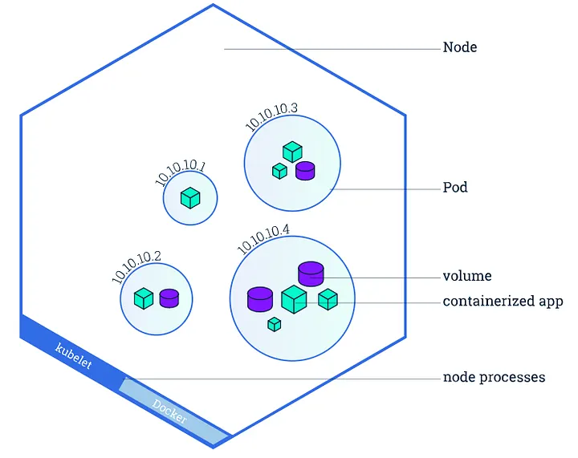
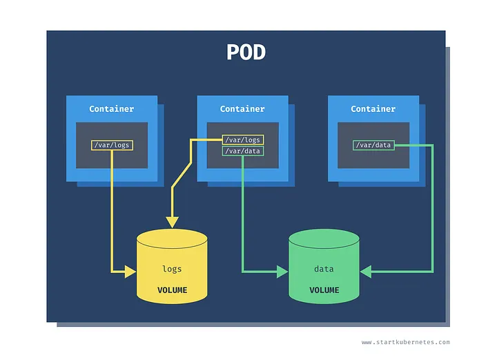
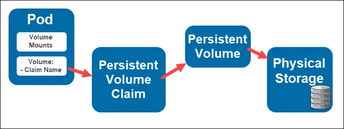

# Kubernetes 基礎架構：從 Cluster 到 Container 與 VM

> 從 Kubernetes cluster 架構圖出發，往下拆解到 Compute Machine、Container Runtime，
> 再延伸到 Container vs VM、Hypervisor、kernel 共用等底層概念。
> 圖片來源：Kubernetes 官方文件與 Red Hat 架構圖。

## 目錄

- [Kubernetes Cluster 架構總覽](#kubernetes-cluster-架構總覽)
- [Compute Machine 內部堆疊](#compute-machine-內部堆疊)
- [Node 內部特寫：Pod 與 Volume](#node-內部特寫pod-與-volume)
- [Persistent Volume 與 PVC](#persistent-volume-與-pvc)
- [部署方式的演進：Traditional → VM → Container](#部署方式的演進traditional--vm--container)
- [Hypervisor 是什麼](#hypervisor-是什麼)
- [Container 的核心：共用 Host Kernel](#container-的核心共用-host-kernel)
- [VM vs Container 總比較](#vm-vs-container-總比較)

---

## Kubernetes Cluster 架構總覽


Kubernetes cluster 的本質是「**一群電腦組成的團隊**」，分成兩種角色：

- **Control Plane**：管理層的機器——只指揮、不跑你的應用程式
- **Compute Machines（Worker Nodes）**：幹活的機器——你的 app（container）全部跑在這裡

### 用工程公司比喻

| 圖中元件 | 比喻 | 實際工作 |
|---|---|---|
| Control Plane | 總部辦公室 | 接單、排班、記帳，自己不搬磚 |
| kube-apiserver | 總機／櫃台 | 所有指令（`kubectl`）都從這裡進來 |
| kube-scheduler | 派工主管 | 決定「這個工作交給哪台機器做」 |
| kube-controller-manager | 監工 | 盯著現場，人手不夠就補、做錯就修正 |
| etcd | 檔案室 | 記錄整個 cluster 的所有狀態 |
| **Compute Machine** | **一個工人** | **實際執行工作（跑 container）** |
| kubelet | 工人耳朵上的對講機 | 聽總部指令「跑這 3 個 pod」，並回報狀況 |
| kube-proxy | 工人之間的電話線 | 處理網路，讓流量能正確找到 pod |

**注意**：Compute Machine 不是電腦裡的某個零件，它就是**一整台電腦**（實體伺服器或 VM）。
圖中 compute machine 框的疊影表示這種機器有**很多台**。

### 圖中其他元件

- **Persistent storage**：container 是用完即丟的，資料要活得比 container 久就得放這裡
- **Container registry**：存放 container image 的倉庫（如 Docker Hub、GCP Artifact Registry）
- **Underlying infrastructure**：cluster 底下的機器可以是實體機、VM、私有雲、公有雲或混合雲——K8s 不在乎底層是什麼

### 部署一個服務的完整流程

1. 你把指令送到 Control Plane（`kubectl apply` → kube-apiserver）
2. kube-scheduler 挑一台有餘裕的 compute machine
3. 那台機器上的 kubelet 收到通知
4. kubelet 叫 container runtime 從 container registry 拉 image
5. 跑起來變成 Pod

**自癒能力的來源**：某台機器掛了 → kube-controller-manager 發現 pod 數量不足 → 透過 apiserver 建立新的 Pod 物件 → kube-scheduler watch 到這個未排程的 Pod，指派給別台機器重跑。（元件之間不直接對話，一切都經過 kube-apiserver）

### 層級關係

```
Cluster ⊃ Node（一台電腦）⊃ Pod ⊃ Container ⊃ 你的 app
```

Pod 是 K8s 調度的**最小單位**——一個小盒子，裡面裝一個（偶爾多個）container。K8s 從不直接管 container，它管的是 pod。

---

## Compute Machine 內部堆疊

每一台 compute machine 的內部長這樣：

```
一台 Compute Machine（= 一台電腦）
├── Hardware（或 VM 的虛擬硬體）
├── Operating System（Linux，有 kernel）
├── Container Runtime（如 containerd）
│   └── Pod → Containers        ← 你的 app 在這
├── kubelet      ← 額外裝的 K8s 代理人
└── kube-proxy   ← 額外裝的 K8s 網路元件
```

其中 **Pod** 這一層值得放大來看——下一張圖就是把一台 Node 打開來看的特寫。

---

## Node 內部特寫：Pod 與 Volume



這張圖（出自 K8s 官方教學）畫的是層級關係中 `Node ⊃ Pod ⊃ Container` 這兩層：

| 圖中元素 | 是什麼 |
|---|---|
| 六邊形 | 一個 Node（一台機器） |
| 圓圈 | Pod，上面標的 `10.10.10.x` 是 **Pod 的 IP** |
| 綠色方塊 | containerized app（container） |
| 紫色圓柱 | volume（儲存空間） |
| 左下斜邊的 kubelet、Docker | node processes——這台機器本身的管理程式，**不住在任何 pod 裡** |

宿舍比喻：Node 是一棟宿舍、Pod 是一間間房間（門牌 = IP 掛在房間上）、container 是房間裡的室友、volume 是房間裡的共用衣櫃、kubelet 是管理室的舍監。

### 1. IP 是發給 Pod 的，不是 container

看 `10.10.10.4` 那個 pod：裡面 3 個 container 共用同一個 IP，因為它們在同一個 network namespace。

- **Pod 內**的 container 互相溝通：直接用 `localhost`——室友在房間裡講話，不用出門
- **Pod 之間**溝通：走網路，用對方的 pod IP

### 2. Pod = 一組綁死在一起的 container + 共享資源

為什麼 `10.10.10.1` 只裝一個 container、`10.10.10.4` 卻塞三個？多 container 的 pod 通常是「主程式 + 副手（sidecar）」——例如主 app + log 收集器 + proxy，它們必須同生共死、一定要在同一台機器上。這就是 K8s 不直接管 container、而發明 Pod 這層包裝的原因。

### 3. Volume 解決資料存活問題

Container 的檔案系統是暫時的，重啟就歸零。Volume 掛在 **pod 層級**：



- 資料活得比 container 久（container 重啟，衣櫃還在）
- 同 pod 的 container 可以透過它交換檔案——上圖中，中間的 container 同時掛了 `logs` 跟 `data` 兩個 volume，和左右兩個 container 各共享一個目錄

需要活得比 pod 更久的資料，則交給 cluster 架構圖裡的 **Persistent storage**（下一節）。

### 時代痕跡：圖裡的 Docker

圖中 container runtime 的位置寫著 **Docker**，但 K8s 1.24 之後已移除 dockershim，現在 node 上跑的多是 **containerd** 或 CRI-O。Docker build 出來的 image 因為符合 OCI 標準，照樣能跑。

---

## Persistent Volume 與 PVC



Pod 裡一般的 volume（如 `emptyDir`）跟 pod 同生共死；要讓資料**活得比 pod 久**，就要接上 cluster 架構圖右上角的 Persistent storage。這張圖講的就是 pod 怎麼「接上」它——一條四站的抽象鏈：

```
Pod → PersistentVolumeClaim（PVC）→ PersistentVolume（PV）→ 實體磁碟
```

### 四站各是什麼

**1. Pod**（圖中最左邊，注意兩個欄位）

- `Volume Mounts`：container 裡的掛載點——「把儲存空間掛到我的 `/data` 目錄」
- `Volume: Claim Name`：這個 volume 從哪來——「去用名叫 `my-claim` 的那張申請單」

**2. PersistentVolumeClaim（PVC）——一張「申請單」**

開發者填的需求單：「我要 10Gi 空間、要能讀寫」。**只講需求，不講來源**——不用知道底層是 AWS 的磁碟還是 NFS。

**3. PersistentVolume（PV）——登記在案的「儲位」**

Cluster 裡實際存在的一塊儲存資源，記錄容量、存取模式、背後對應哪塊真實磁碟。K8s 會自動把 PVC 和條件相符的 PV **綁定（bind）**。

**4. Physical Storage——真實的磁碟**

AWS EBS、GCP Persistent Disk、NFS、Ceph……真正放資料的地方。

### 延續宿舍比喻

Pod（房間）的行李不能堆房間裡——房間隨時會被拆掉重蓋。所以：

- **PVC** = 向管理處遞交的**倉庫申請單**：「我要 2 箱的空間」
- **PV** = 管理處在倉庫裡**劃好編號的儲位**
- **Physical Storage** = 倉庫建築本身

你（開發者）只管填申請單；管理處（管理員／雲端）負責讓儲位存在，兩邊互不干涉。

### 為什麼要隔 PVC / PV 兩層？

核心目的：**把「用儲存的人」和「供儲存的人」解耦**。

| | PVC | PV |
|---|---|---|
| 誰負責 | 開發者 | 管理員（或雲端自動供應） |
| 關心什麼 | 需求：多大、怎麼存取 | 供給：空間實際從哪來 |

好處是 deployment YAML 完全可攜：同一份設定在 GCP 上背後接 Persistent Disk，搬到 AWS 換成 EBS——pod 和 PVC 一個字都不用改，只換 PV 那層。

> 現代實務很少手動建 PV。多數 cluster 設好 **StorageClass** 後走「動態供應（dynamic provisioning）」——PVC 一出現，K8s 自動向雲端要一塊磁碟、生成對應的 PV 綁上去。申請單一遞，儲位自動生出來。

而 **Container Runtime** 這一層到底是什麼——要理解它，得回頭看部署方式的演進。

---

## 部署方式的演進：Traditional → VM → Container


### Traditional Deployment（傳統部署）

App 直接跑在實體機的 OS 上。問題：多個 app 搶同一台機器的資源、互相干擾；一個 app 一台機器又太浪費。

### Virtualized Deployment（虛擬化部署）

在硬體之上用 **Hypervisor** 切出多台 VM，每台 VM 有自己**完整的 Guest OS**，app 之間強隔離。

### Container Deployment（容器化部署）

Container 之間共用**同一個 OS kernel**，每個 container 只打包 App + Bin/Library，由 **Container Runtime** 負責管理。

### Bin/Library 是什麼

**Bin**（binaries）和 **Library** 指的是 app 運行時依賴的環境：

- **Bin**：編譯好的執行檔與工具，例如 `bash`、`curl`、`node`，放在 `/bin`、`/usr/bin`
- **Library**：共享函式庫，例如 `glibc`（C 標準庫）、`libssl`，放在 `/lib`、`/usr/lib`

App 不是一個檔案就能跑起來的，它需要這一整組依賴。兩種部署方式的關鍵差異在於**這層依賴跟著誰**：

- **VM**：Bin/Library 裝在每台 VM 的 Guest OS 裡
- **Container**：每個 container 自己打包一份 Bin/Library（**這就是 Docker image 的內容物**），但共用底下同一個 kernel。所以同一台主機上，一個 container 用 Ubuntu 的函式庫、另一個用 Alpine 的，互不干擾

---

## Hypervisor 是什麼

Hypervisor（又叫 VMM，Virtual Machine Monitor）是**專門用來創造和管理 VM 的軟體**。它把一台實體機的硬體資源（CPU、記憶體、硬碟、網卡）切分、模擬成多套「虛擬硬體」，讓多個 OS 同時跑在同一台機器上，且彼此以為自己獨佔整台電腦。

主要負責三件事：

1. **資源分配**：每台 VM 分到幾顆 CPU、多少記憶體
2. **隔離**：VM 之間互不干擾——A 掛了不拖垮 B，A 讀不到 B 的記憶體
3. **指令攔截**：Guest OS 以為自己直接操作硬體，實際上敏感操作都被 hypervisor 攔截，安全地轉給真實硬體

### Type 1 vs Type 2

```
Type 1:  硬體 → Hypervisor → VM們             （資料中心、雲端）
Type 2:  硬體 → Host OS → Hypervisor → VM們   （個人開發測試）
```

| | Type 1（Bare-metal 裸機型） | Type 2（Hosted 寄居型） |
|---|---|---|
| 位置 | 直接裝在硬體上，自己就是最底層 | 像一般 app 裝在現有 OS 上 |
| 效能 | 好 | CPU 接近原生（現代也用硬體虛擬化），I/O 因多經 Host OS 一層而略差 |
| 例子 | VMware ESXi、Hyper-V、Xen、KVM（見下方模糊地帶） | VirtualBox、VMware Fusion、Parallels |
| 使用場景 | AWS EC2、GCP 等雲端底層 | 個人電腦開發測試 |

### 模糊地帶：現代 kernel 整合式虛擬化

Mac 上的 Docker Desktop 用 macOS 內建的 **Virtualization.framework** 先開一台 Linux VM，container 才跑在裡面。這算 Type 2 嗎？

- **通常歸類為 Type 2**：有 Host OS（macOS）在底下，VM 跑在它之上
- **但嚴格說是模糊地帶**：真正的虛擬化能力內建在 macOS kernel（XNU）裡，以最高特權層級直接使用 CPU 的硬體虛擬化功能（Apple Silicon 的 EL2、Intel VT-x），不像傳統 Type 2 是 user space 程式透過 Host OS 的介面間接操作

這跟 Linux 的 **KVM** 同一種模式——kernel module 載入後，整個 kernel 本身變成 hypervisor。有人稱之為 Type 1.5 或 hybrid：

- 像 Type 2：有完整的通用 OS 在跑
- 像 Type 1：虛擬化邏輯以最高特權在 kernel／硬體層級執行，不像傳統 Type 2 要從 user space 繞一圈

對照：Windows 的 Hyper-V 是真正的 Type 1（獨立的 microkernel hypervisor，開機時載入在 Windows 之下），啟用後 **Windows 自己會被降格成一台 VM**——但它是特權的 root partition，保有大部分硬體的直接存取權並負責管理其他 VM；WSL2 的 Linux 則跑在輕量的 child partition 裡。兩者都在 Hyper-V 之上，但地位不平等。

> 面試場合答「Type 2」是安全的，但可以補充：現代 kernel 整合式虛擬化（KVM、Hypervisor.framework）已讓這個 1970 年代的分類法不太夠用——Hyper-V 則示範了另一種失準：桌機上開一個功能，整台 Host OS 就被降級到 Type 1 hypervisor 之上。實務上更重要的是虛擬化邏輯跑在哪個特權層級、是否由硬體加速。

---

## Container 的核心：共用 Host Kernel

> 「Container 不生成整個 OS kernel，透過直接調用 OS kernel」這句話的意思。

### 先懂 kernel 在幹嘛

Kernel 是 OS 最底層的程式，**唯一有權直接操作硬體的人**。App 做任何真正的事——開檔案、要記憶體、送封包——都必須透過 **system call** 拜託 kernel 代勞：

```
App：「我要開啟 /data/log.txt」
   ↓ system call: open()
kernel：操作磁碟驅動程式，把檔案內容讀給你
```

一個程式要能跑，背後一定要有一個 kernel 在服務它。問題只是：**這個 kernel 是誰的？**

### VM：自己生成一個 kernel

VM 開機時，Guest OS 在記憶體裡完整載入並啟動一個**屬於自己的 kernel**，app 的 system call 由 guest kernel 接手。這裡要分兩種情況：

- **純 CPU／記憶體操作**（如 `getpid`、記憶體配置）：在硬體輔助虛擬化（Intel VT-x、AMD-V、ARM EL2）下，guest kernel 直接在真實 CPU 上原生執行，速度與裸機幾乎相同，**不會經過 hypervisor**
- **裝置 I/O**（開檔案要讀磁碟、送封包要過網卡）：路徑就長了——

```
App → Guest kernel → 虛擬裝置（虛擬磁碟／網卡）→ Hypervisor → Host 真實硬體
```

所以 VM 的主要成本不是「每個 syscall 都變慢」，而是 **I/O 要多穿一層虛擬裝置**，加上每台 VM 都要多養一整套 Guest OS：開機花時間、常駐吃幾百 MB 到數 GB 記憶體。

### Container：直接用宿主機的 kernel

Container 裡面**沒有 kernel**。裡面的 app 發出 system call 時，接電話的就是**宿主機本人的 kernel**：

```
App（在 container 裡）→ Host kernel → 硬體
```

路徑跟直接在宿主機跑一個普通程式**一模一樣**。Container 本質上只是宿主機上的一個**被隔離的 process**，靠 Linux kernel 兩個機制實現：

- **namespaces**：讓 process「看不到」別人——有自己的檔案系統視角、網路、process 列表
- **cgroups**：限制它能用多少 CPU、記憶體

所以：

- **不用開機**——container「啟動」只是 fork 一個 process，秒級甚至毫秒級
- **體積小**——image 只需要 App + Bin/Library，不用塞 kernel 和整套 OS
- **沒有 I/O 虛擬化損耗**——檔案、網路直接走 host kernel 與真實驅動，不用穿越虛擬裝置層

### 親手驗證：container 沒有自己的 kernel

在 Linux 主機上跑一個 Ubuntu container，看它的 kernel 版本：

```bash
# 宿主機（假設是 Debian，kernel 6.1.0）
$ uname -r
6.1.0-18-amd64

$ docker run ubuntu uname -r
6.1.0-18-amd64        # ← 跟宿主機一模一樣！
```

明明是「Ubuntu」container，回報的卻是宿主機的 kernel。因為 Ubuntu image 只是一包 Ubuntu 風格的檔案（apt、glibc、目錄結構——也就是 Bin/Library），kernel 從頭到尾都是宿主機那一個。

### 天生限制

Container 必須跟宿主機用**同一種 kernel**：Linux container 只能跑在 Linux kernel 上。
這就是為什麼 Mac 跑 Docker 要先開一台 Linux VM 墊底。

---

## VM vs Container 總比較

核心差異一句話：**VM 虛擬化的是「硬體」，Container 虛擬化的是「作業系統」**。

| | Virtual Machine | Container |
|---|---|---|
| 隔離層 | Hypervisor 模擬虛擬硬體 | Container Runtime 利用 kernel 功能隔離 |
| 作業系統 | 每台 VM 有完整 Guest OS（含 kernel） | 所有 container 共用宿主機 kernel |
| 體積 | GB 等級 | MB 等級（只有 App + Bin/Library） |
| 啟動速度 | 分鐘等級（要開機） | 秒級（只是啟動一個 process） |
| 隔離強度 | 強（連 kernel 都獨立） | 較弱（kernel 被攻破影響全部 container） |
| 資源開銷 | 每台 VM 養一份 OS | 幾乎只有 app 本身 |
| 跨 OS | 可以（Linux 主機跑 Windows VM） | 不行（必須同種 kernel） |

**實務上兩者不互斥**：雲端環境通常是「VM 裡面跑 container」——用 VM 做租戶間的強隔離，用 container 做應用程式的打包與部署。Kubernetes 管理的就是 container 這一層。
