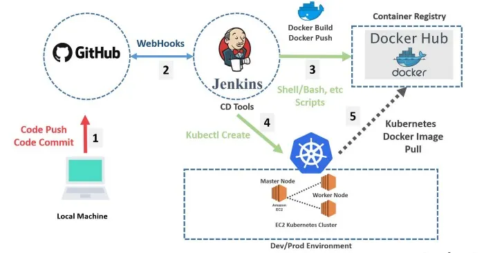

# Kubernetes CI/CD Pipeline：從 push code 到服務上線

> 以 GitHub + Jenkins + Docker Hub + K8s（AWS EC2）為例的經典 CI/CD 流程。
> Cluster 架構、image、container registry 等基礎概念見 [infrastructure](infrastructure.md)。



## 一句話總結

工程師 `git push` 之後**不需要任何人手動操作**：程式碼自動被打包成 Docker image、上傳到 registry、部署到 Kubernetes cluster。這條自動化生產線就是 CI/CD pipeline，圖中的編號 1–5 就是它的五個步驟。

---

## 五個步驟

### 1. Code Push——工程師唯一要做的事

在本機 commit，push 到 GitHub。對工程師來說，整條 pipeline 的觸發動作就只有這一下。

### 2. WebHook——GitHub 主動通知 Jenkins

GitHub 收到新 code 後，透過 **webhook** 主動發一個 HTTP request 通知 Jenkins：「有新東西進來了」。

- Webhook 是**推播**模式：事件發生時來源主動通知，而不是 Jenkins 每隔幾秒去問「有新 code 嗎？」（輪詢）
- 圖中箭頭是雙向的：GitHub 通知 Jenkins 之後，Jenkins 回頭把最新的 code clone 下來

**Jenkins 是什麼**：老牌的 CI/CD 伺服器——一台專門「聽到 code 有變動，就自動執行一連串指令」的機器。要執行什麼寫在 pipeline 設定檔裡（Jenkinsfile）。

### 3. Docker Build & Push——打包成 image

Jenkins 拿到 code 後執行：

```bash
# 通常還會先跑測試，測試過了才繼續
docker build -t myuser/my-app:v1.2.3 .   # 打包：App + Bin/Library → image
docker push myuser/my-app:v1.2.3          # 上傳（需先 docker login）
```

- 產出的 **image** 就是 infrastructure 筆記講的「App + Bin/Library」那一包
- Image 名稱的**前綴決定推去哪個 registry**：省略時預設 Docker Hub（docker.io），且必須掛在自己的帳號 namespace 下（`myuser/my-app`——光寫 `my-app` 會被解析成官方保留區 `library/my-app`，推了會被拒絕）；推私有 registry 則寫完整 hostname，如 `123456789.dkr.ecr.us-east-1.amazonaws.com/my-app:v1.2.3`
- **Docker Hub** 扮演的角色就是 cluster 架構圖右下角的 **Container Registry**（實務上公司多半用私有的，如 AWS ECR、GCP Artifact Registry）

### 4. Kubectl Create——通知 cluster 部署

Jenkins 執行 shell script，用 `kubectl create` / `kubectl apply` 把新版的部署設定（image 換成 `v1.2.3`）送進 cluster。

- 這道指令進的是 control plane 的 **kube-apiserver**——呼應 infrastructure 筆記的鐵律：所有指令都經過 apiserver
- 注意：**Jenkins 送的只是「設定」（YAML），不是 image 本身**——image 走的是 3 → 5 那條路
- 圖中寫 `kubectl create`，但它只適用**第一次建立**——資源已存在會報 `AlreadyExists`。會反覆執行的 pipeline 實務上要用 `kubectl apply`（宣告式、可重複執行）或 `kubectl set image` 才能更新既有的 Deployment

### 5. Image Pull——cluster 把 image 拉下來跑

Cluster 收到新設定後，接手的就是 infrastructure 筆記裡的部署流程：scheduler 挑機器 → 該機器的 kubelet 叫 container runtime 去 **Docker Hub 拉 image** → 跑成 pod。圖中的虛線箭頭就是這個 pull 動作。

---

## CI 和 CD 分別是哪一段

| 縮寫 | 全名 | 對應步驟 | 做什麼 |
|---|---|---|---|
| **CI** | Continuous Integration（持續整合） | 1–3 | code 一進來就自動 build、跑測試、產出 image |
| **CD** | Continuous Deployment/Delivery（持續部署/交付） | 4–5 | 自動把新版本部署到環境上 |

分界點很清楚：**CI 的終點是「一個測試通過、可部署的 image 躺在 registry 裡」；CD 負責把它變成線上跑著的服務。**

CD 的兩種意思要分清楚（面試常考）：**Delivery（持續交付）**= 隨時維持可部署狀態，但上 production 前可以保留人工核准那道關卡；**Deployment（持續部署）**= 連上線都全自動。這張圖的零人工流程屬於後者。

---

## 對照 infrastructure 筆記的概念

| 這張圖 | infrastructure 筆記的對應 |
|---|---|
| Docker Hub | Container Registry（cluster 架構圖右下角） |
| Master Node | Control Plane（舊術語，K8s 現已改稱 control plane node） |
| Worker Node | Compute Machine |
| Amazon EC2 | Underlying infrastructure 中「Public cloud + Virtual」那格——cluster 跑在雲端 VM 上 |
| 步驟 5 的 image pull | 部署流程的「kubelet 叫 container runtime 從 registry 拉 image」 |

---

## 這張圖的年代痕跡與現代變體

這張圖是經典教學款，實務上每個環節都有更現代的選擇：

- **Jenkins** → 新專案更常用 **GitHub Actions**、GitLab CI 等——不用自己養一台 CI 伺服器，webhook 那步也內建了
- **`kubectl create`** → 實務多用 `kubectl apply`（宣告式、可重複執行），或更進一步用 **Helm**（`helm upgrade`，見 [what is Helm](what%20is%20Helm.md)）管理整包設定
- **推式部署 → GitOps 拉式部署**：圖中是 Jenkins「推」設定進 cluster；GitOps 工具（**ArgoCD**、Flux）反過來——cluster 裡跑一個 agent 盯著 git repo，設定一改就自己同步。好處是 git 成為唯一的真相來源，cluster 的憑證也不用交給 CI 伺服器
- **Master Node** 這個詞已被 K8s 官方棄用，改稱 **control plane node**

不過骨架不變：**code → 自動測試打包 → image 進 registry → cluster 收到新設定 → 拉 image 跑起來**。換工具只是換零件，這條線是所有現代部署流程的共同骨架。
