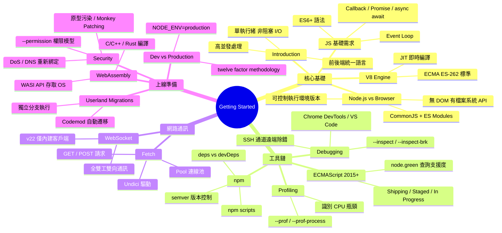
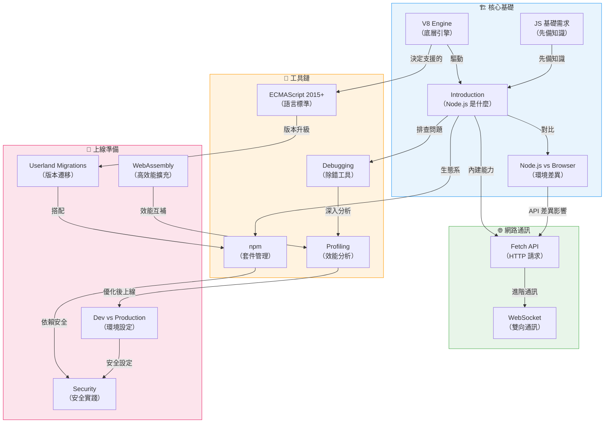

# Getting Started — 視覺化總覽

## 心智圖：章節重點一覽

```mermaid
mindmap
  root((Getting Started))
    核心基礎
      Introduction
        單執行緒 非阻塞 I/O
        高並發處理
        前後端統一語言
      JS 基礎需求
        ES6+ 語法
        Callback / Promise / async await
        Event Loop
      Node.js vs Browser
        無 DOM 有檔案系統 API
        可控制執行環境版本
        CommonJS + ES Modules
      V8 Engine
        JIT 即時編譯
        ECMA ES-262 標準
    工具鏈
      npm
        deps vs devDeps
        semver 版本控制
        npm scripts
      ECMAScript 2015+
        Shipping / Staged / In Progress
        node.green 查詢支援度
      Debugging
        --inspect / --inspect-brk
        Chrome DevTools / VS Code
        SSH 通道遠端除錯
      Profiling
        --prof / --prof-process
        識別 CPU 瓶頸
    網路通訊
      Fetch
        Undici 驅動
        GET / POST 請求
        Pool 連線池
      WebSocket
        全雙工雙向通訊
        v22 僅內建客戶端
    上線準備
      Dev vs Production
        NODE_ENV=production
        twelve factor methodology
      Security
        DoS / DNS 重新綁定
        原型污染 / Monkey Patching
        --permission 權限模型
      WebAssembly
        C/C++ / Rust 編譯
        WASI API 存取 OS
      Userland Migrations
        Codemod 自動遷移
        獨立分支執行
```

## 關聯圖：章節之間的知識脈絡

```mermaid
flowchart TB
    subgraph core["🏗️ 核心基礎"]
        intro["Introduction\n（Node.js 是什麼）"]
        v8["V8 Engine\n（底層引擎）"]
        diff["Node.js vs Browser\n（環境差異）"]
        js["JS 基礎需求\n（先備知識）"]
    end

    subgraph toolchain["🔧 工具鏈"]
        npm["npm\n（套件管理）"]
        es6["ECMAScript 2015+\n（語言標準）"]
        debug["Debugging\n（除錯工具）"]
        profile["Profiling\n（效能分析）"]
    end

    subgraph network["🌐 網路通訊"]
        fetch["Fetch API\n（HTTP 請求）"]
        ws["WebSocket\n（雙向通訊）"]
    end

    subgraph production["🚀 上線準備"]
        devprod["Dev vs Production\n（環境設定）"]
        security["Security\n（安全實踐）"]
        wasm["WebAssembly\n（高效能擴充）"]
        migration["Userland Migrations\n（版本遷移）"]
    end

    %% 核心基礎的關聯
    v8 -->|"驅動"| intro
    js -->|"先備知識"| intro
    intro -->|"對比"| diff

    %% 核心 → 工具鏈
    intro -->|"生態系"| npm
    v8 -->|"決定支援的"| es6
    intro -->|"排查問題"| debug
    debug -->|"深入分析"| profile

    %% 核心 → 網路
    intro -->|"內建能力"| fetch
    fetch -->|"進階通訊"| ws

    %% 工具鏈 → 上線
    npm -->|"依賴安全"| security
    profile -->|"優化後上線"| devprod
    es6 -->|"版本升級"| migration

    %% 上線準備內部
    devprod -->|"安全設定"| security
    migration -->|"搭配"| npm

    %% 跨組關聯
    diff -->|"API 差異影響"| fetch
    wasm -->|"效能互補"| profile

    style core fill:#e8f4fd,stroke:#2196F3
    style toolchain fill:#fff3e0,stroke:#FF9800
    style network fill:#e8f5e9,stroke:#4CAF50
    style production fill:#fce4ec,stroke:#E91E63
```
