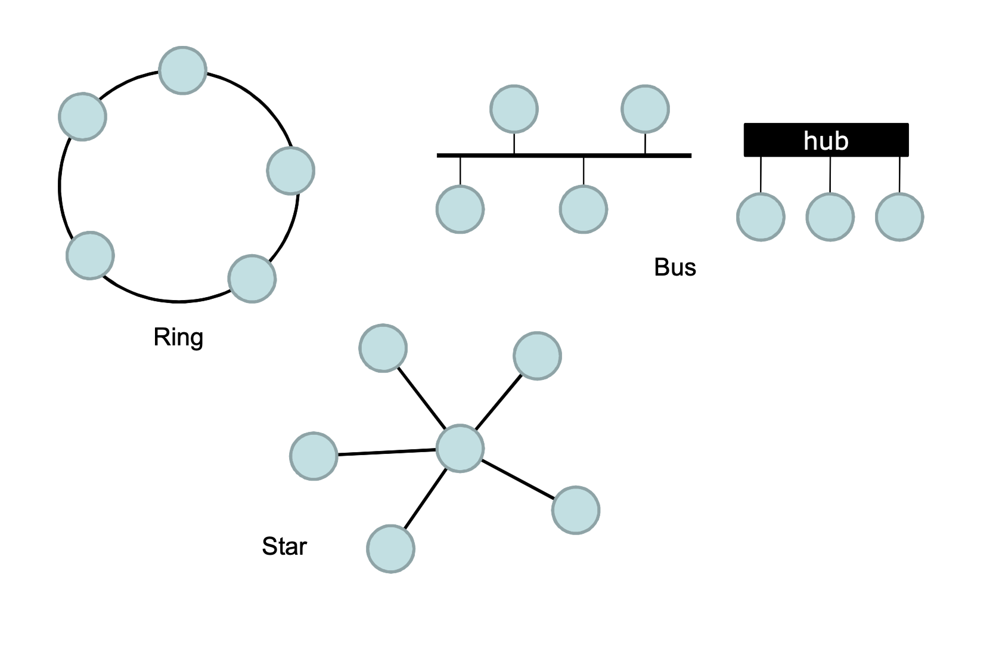
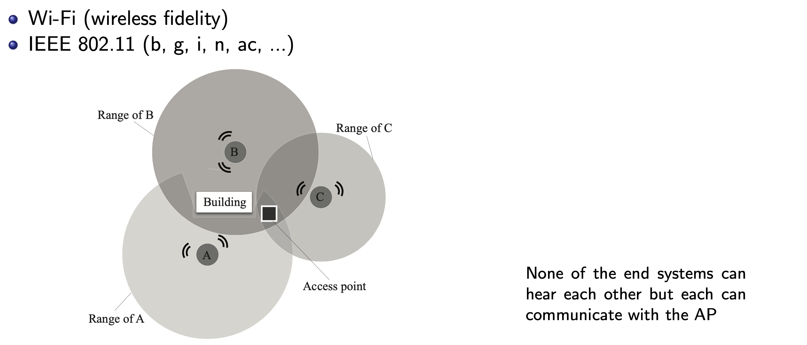
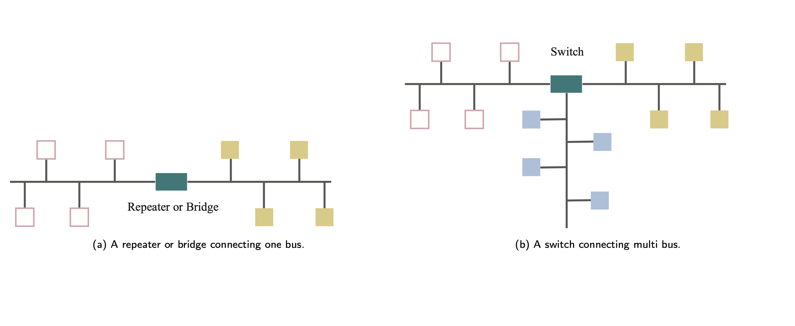
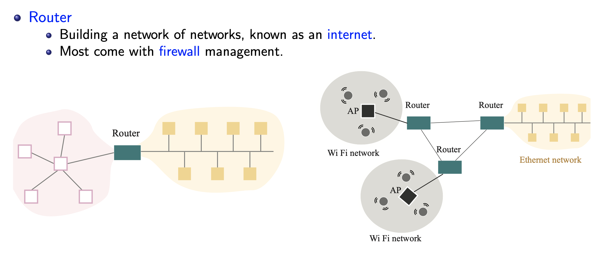
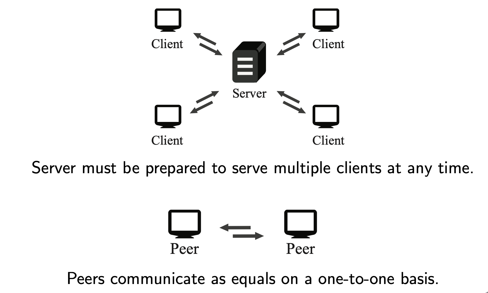
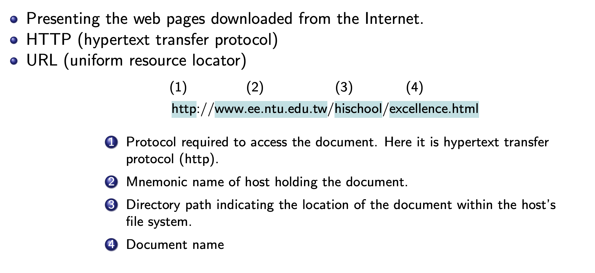
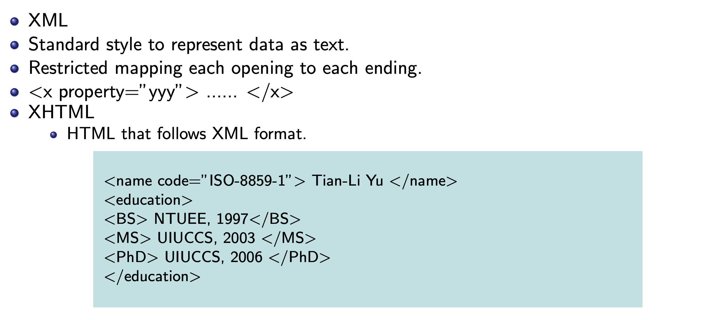
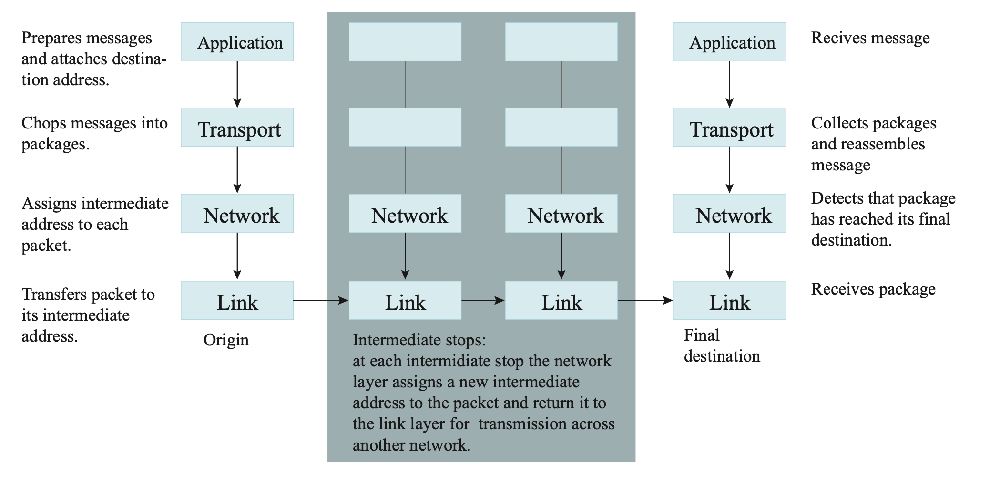

# Network

### Scope
- LAN: local area network
- MAN: metropolitan area network 由相互連接的 LAN 組成
- WAN: wide area network

### Network topology

### Wireless & access point

### Repeater, Bridge, Switch

### Router

### Interprocess Communication

### Internet Service Provider(ISP)
ex: 中華電信

### IP(internet protocol) Address
- 32 bits in IPv4 (all are allocated in Feb. 2011) 
- 128 bits in IPv6
- Network identifier (by ICANN)
- Host address (domain administrator)

### Host Name
ex: `www.ee.ntu.edu.tw`

- domain name:
    - Assigned by a registrar 
    - Top-level domain
    By usage: `.edu` = education `.tw` = Taiwan

- Subdomains and individual host names:
    - Assigned by domain owner 
    - ex: `www.ee.ntu`

- ask DNS(domain name server) for IP
`www.ee.ntu.edu.tw → 140.112.18.33`

### Internet Applications

- VoIP (voice over Internet protocol) 
- email (electronic mail)
- FTP (file transfer protocol)
- telnet & ssh (secure shell)
- P2P: bittorrent, edonkey, emule...

### www
- www, w3 = world wide web
- webpage = hypertext document

### Browser

### XML(extensive markup language)

### Client side vs server side
- client side:
    - Java applets
    - Javascripts 
    - Flash

- server side
    - CGI
    - Servlets (jsp, asp)
    - PHP (Personal Home Page, PHP Hypertext Processor)

### internet protocol
- Layers:
    - Application: constructs message with address
    - Transport: chops message into packets 
    - Network: handles routing through the Internet 
    - Link: handles actual transmission of packets

### Port(埠)
- Incoming messages are delivered to different applications by unique port numbers. 
- Some typical ports: ftp (21), telnet (23), ssh (22), http (80), etc.
