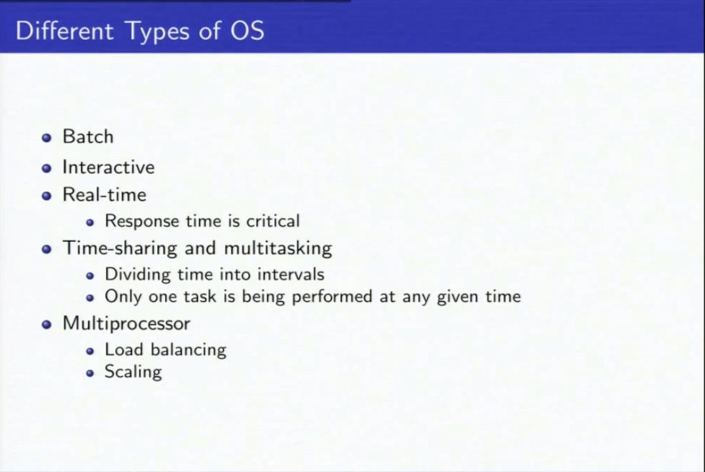
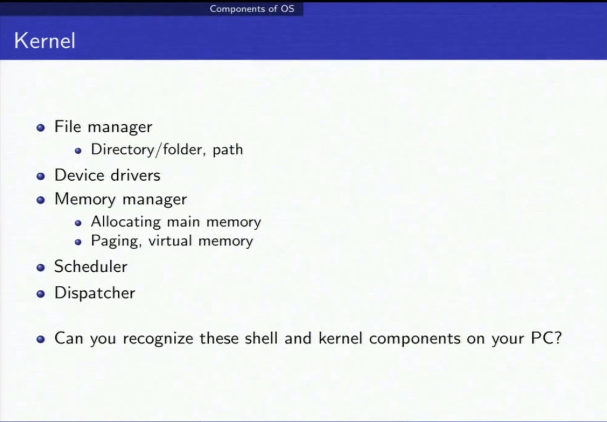
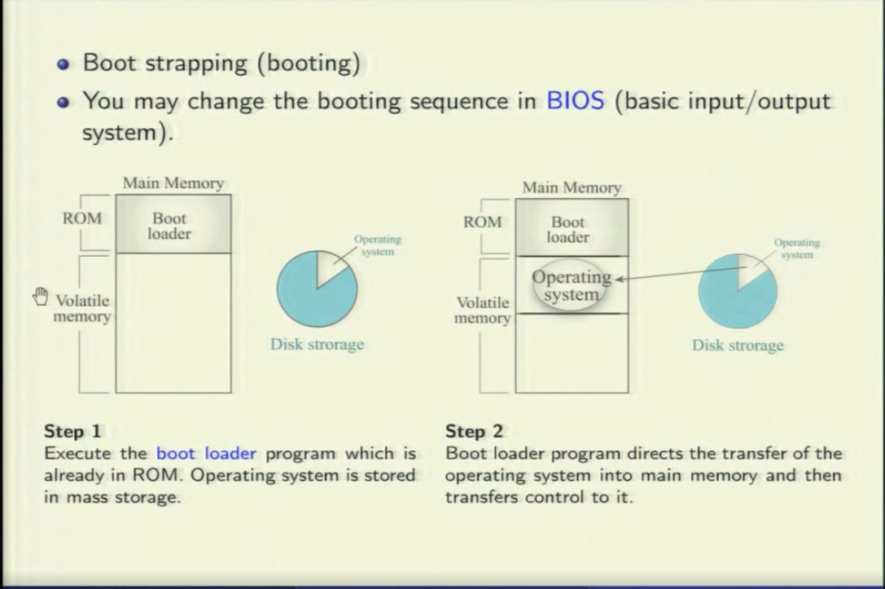
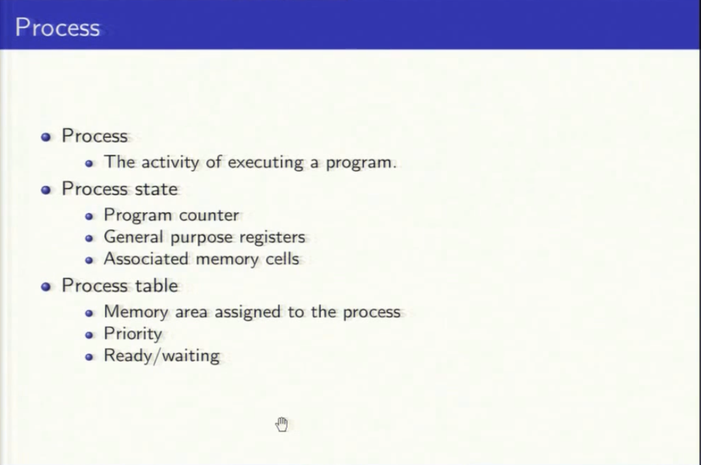

## Different Types of OS
**Multiprocessor（多處理器）：** 多個 CPU 同時執行不同的任務或處理多個任務，可以提高計算機系統的性能和效率，因為它們可以平行處理多個任務，而不是依賴單個處理器來處理所有任務。

**Load Balancing（負載平衡）：** 負載平衡是一種技術，用於在多個計算資源（如處理器、存儲、網絡帶寬等）之間分配工作負載，以確保系統的資源被充分利用並且避免某些資源過度負載而造成性能下降。

**Scaling（擴展）：** 在計算機科學中，擴展指的是增加系統的容量或能力，以應對更大的工作負載或更高的性能需求。擴展可以是垂直的，即通過提高單個系統的性能來應對更高的負載；也可以是水平的，即通過增加更多的計算機資源來應對更大的負載。水平擴展通常與多處理器系統和分佈式系統相關，而垂直擴展則通常與單個計算機系統的硬體升級相關。

## Shells
user 和 kernel 溝通的媒介
- Text based
- GUI (graphics user interface)

## Kernel
**allocating main memory：** 檔案通常都是分散的被存在不同的 cell 中，這樣才能有效的運用儲存空間

**virtual memory：** 程式執行時一定在主記憶體。虛擬記憶體是把硬碟的某些空間拿來儲存，當需要的時候在從硬碟拿出來放到主記憶體執行

## Booting (開機)
**ROM :** read only memory, Boot loader 放在主機板裡面的 ROM 裡面，負責從硬碟讀取 OS 放到主記憶體並把控制權交給 OS

## Process
Scheduler 和 Dispatcher 負責處理 process

**associated memory cells:**
因為主記憶體可能不夠，process 可能暫時被放到虛擬記憶體中(硬碟)，等被換回主記憶體時需要知道當初的相對位置，運算才不會出錯

**process table:**
工作管理員裡的處理程序 table 
