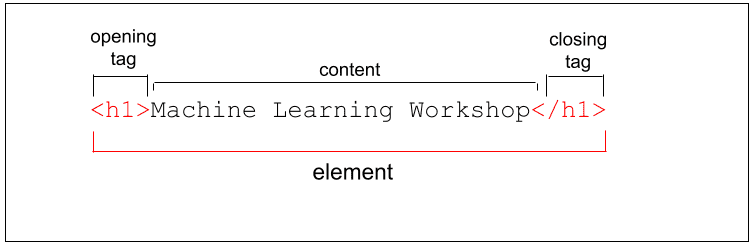
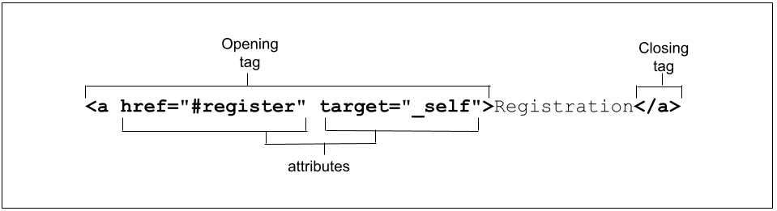

# HTML (HyperText Markup Language)
- HTML documents are basically a tree of nodes, including HTML elements and text nodes. 
- HTML elements provide the semantics and formatting for documents, including creating paragraphs, lists and tables, and embedding images and form controls.

# Elements
- HTML elements are delineated by tags, written using angle brackets (< and >).


- HTML is not case-sensitive, but some attribute values are.

# Document structure
### `<!DOCTYPE html>`

The doctype tells the browser to use standards mode. If omitted, browsers will use a different rendering mode known as quirks mode. Including the doctype helps prevent quirks mode.


### `html`
    
the root element for an HTML document. It is the parent of the <head> and <body>, containing everything in the HTML document other than the doctype

The lang language attribute added to the <html> tag defines the main language of the document.

The lang attribute is not limited to the <html>tag. If there is text within the page that is in a language different from the main document language, the lang attribute should be used to identify exceptions to the main language within the document.
```html
<span lang="fr-fr">Ceci n'est pas une pipe.</span>
```
can be targeted with the attribute and language selectors [lang|="fr"] and :lang(fr).

----

### Character encoding

The very first element in the <head> should be the charset character encoding declaration.

To set the character encoding to UTF-8, include:
```html
<meta charset="utf-8" />
```

### Document title
```html
<title>ML Workshop</title>
```
displayed in the browser tab, the list of open windows, the history, search results, and, unless redefined with <meta> tags, in social media cards.

### Viewport metadata
```html
<meta name="viewport" content="width=device-width, initial-scale=1, user-scalable=1" />
```
The preceding code means "make the site responsive, starting by making the width of the content the width of the screen".

### CSS
There are three ways to include CSS: `<link>`, `<style>`, and the style attribute.

The main two ways to include styles in your HTML file are by including an external resource using a `<link>` element with the rel attribute set to stylesheet, or including CSS directly in the head of your document within opening and closing `<style>` tags.

Linking a single or a few external style sheets is good for both developer experience and site performance: you get to maintain CSS in one spot instead of it being sprinkled everywhere, and browsers can cache the external file, meaning it doesn't have to be downloaded again with every page navigation.

The syntax is `<link rel="stylesheet" href="styles.css">`, where styles.css is the URL of your stylesheet. You'll often see type="text/css". Not necessary! If you are including styles written in something other than CSS, the type is needed

If you want your external style sheet styles to be within a cascade layer but you don't have access to edit the CSS file to put the layer information in it, you'll want to include the CSS with `@import` inside a `<style>`:

``` html
<style>
  @import "styles.css" layer(firstLayer);
</style>

<style>
  :root {
    --theme-color: #226DAA;
  }
</style>
```

Adding styles first prevents the unnecessary repainting that occurs if an element is styled after it is first rendered.

### `<link>`
The `link` element is used to create relationships between the HTML document and external resources. Some of these resources may be downloaded, others are informational.

It's preferable to include those related to meta information in the head and those related to performance in the `<body>`.

### Favicon
Use the `<link>` tag, with the `rel="icon"` attribute/value pair to identify the favicon to be used for your document.

If you don't declare a favicon, the browser will look for a file named favicon.ico in the top-level directory (the website's root folder). With `<link>`, you can use a different file name and location:
```html
<link rel="icon" sizes="16x16 32x32 48x48" type="image/png" href="/images/mlwicon.png" />

/** for iOS and macOS Safari */
<link rel="apple-touch-icon" sizes="180x180" href="/images/mlwicon.png" />
<link rel="mask-icon" href="/images/mlwicon.svg" color="#226DAA" />
```

### Alternate versions of the site
We use the alternate value of the rel attribute to identify translations, or alternate representations, of the site.

When using alternate for a translation, the `hreflang` attribute must be set
```html
<link rel="alternate" href="https://www.machinelearningworkshop.com/fr/" hreflang="fr-FR" />
<link rel="alternate" href="https://www.machinelearningworkshop.com/pt/" hreflang="pt-BR" />
```

### Canonical
If you create several translations or versions of Machine Learning Workshop, search engines may get confused as to which version is the authoritative source. For this, use `rel="canonical"` to identify the preferred URL for the site or application.
```html
<link rel="canonical" href="https://www.machinelearning.com" />
```

### Scripts
The `<script>` tag is used to include, well, scripts. The default type is JavaScript. If you include any other scripting language, include the type attribute with the mime type, or `type="module"` 

add the `<script>` at the bottom of the `<body>` rather than in the `<head>`

ensure elements exist before the script referencing them

render-blocking, the browser stops downloading all assets when scripts are downloaded and doesn't resume downloading other assets until the JavaScript has finished

defer & async


### `<base>`
```html
<base target="_top" href="https://machinelearningworkshop.com" />
```
there can be only one <base> element in a document.

The `<base>` effectively converts the link `<a href="#ref">` to `<a target="_top" href="https://machinelearningworkshop.com#ref">`, triggering an HTTP request to the base URL with the fragment attached.