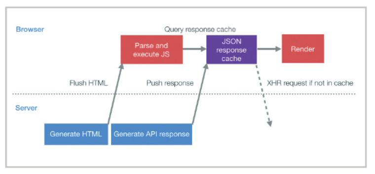
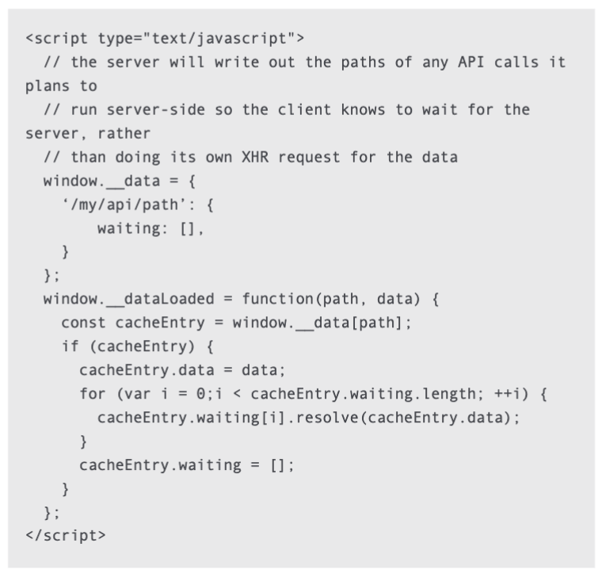

# summary:
- preload
- image prefetching, requestIdleCallback, change request priority if necessary
-  pushing data using early flushing and progressive HTML rendering

# questions:
1. why preload async route bundles block `common.js` scripts parsed/compiled ?
2. img srcset attribute ?
3. bandwidth ?
4. we talked about http chucked transfer encoding and progressive HTML rendering in the browser,what is the first chuck from html looks like?

5. the server start working on generating the api response immediately after the html has been generated and to push it to the client.the first step in making this change was to create a json cache to store the server responses

